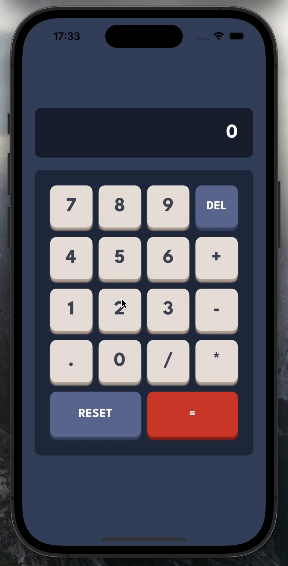
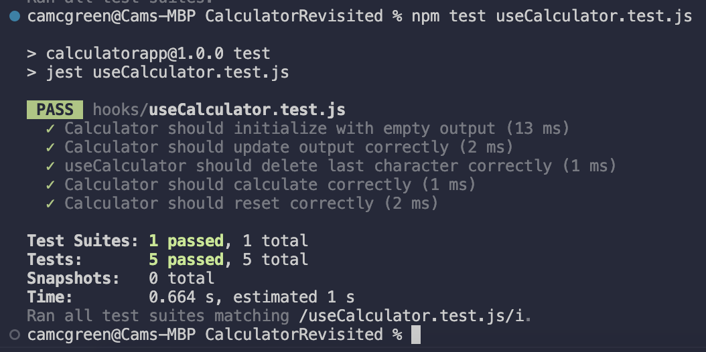

# Revisited Technical Test



### Objective

The task was to build a simple React Native calculator app in 90 minutes. This repo is the version of the app I kept building after the timer expired.

### Get Up & Running

- Once you have cloned the repo:
  - npm install
  - npx expo start

### Calculator Component

#### Description

The `Calculator` component is a simple calculator interface. It is a functional component that uses the `useCalculator` custom hook to manage its state and handle user interactions.

#### Props

The `Calculator` component does not accept any props.

#### Styles

The `Calculator` component uses the following styles:

- `container`: This style is used for the main container of the `Calculator` component. It is a flex container that takes up the full width of its parent and centres its children both vertically and horizontally.
- `output`: This style is used for the output display of the calculator. It makes the display take up the full width of its parent, have a dark background, and have rounded corners.
- `outputText`: This style is used for the text in the output display. It makes the text large, white, and aligned to the right.
- `input`: This style is used for the input area of the calculator. It makes the input area take up the full width of its parent, have a slightly lighter dark background than the output display, and have rounded corners.
- `row`: This style is used for rows of buttons in the calculator. It makes the buttons in a row evenly distributed and have a small margin at the bottom.
- `button`: This style is used for the general buttons in the calculator. It makes the buttons square, have a light background, and have a shadow.
- `delButton`: This style is used for the delete button in the calculator. It makes the button have a medium-dark blue background and a shadow.
- `resetButton`: This style is used for the reset button in the calculator. It makes the button twice as wide as it is tall, have a medium-dark blue background, and have a shadow.
- `equalsButton`: This style is used for the equals button in the calculator. It makes the button twice as wide as it is tall, have a red background, and have a shadow.
- `lightText`: This style is used for the text on the buttons with a dark background. It makes the text bold, medium-sized, and white.
- `darkText`: This style is used for the text on the buttons with a light background. It makes the text bold, large, and dark.

#### Usage

```jsx
import Calculator from './Calculator'

function App() {
  return <Calculator />
}
```

### useCalculator Hook

#### Description

The `useCalculator` hook is a custom React hook that provides state and handler functions for the calculator. It uses the `useState` hook from React to manage the calculator's output.

#### State

The hook has one piece of state: `output`. This is a string that represents the current output of the calculator.

#### Functions

The hook provides the following functions:

- `updateOutput(value)`: This function takes a string `value` and appends it to the current `output`. If `value` results in an invalid operation when appended to `output`, the function does nothing, ensuring only valid operations will be carried out.

- `deleteLastChar()`: This function removes the last character from the current `output`.

- `calculate()`: This function evaluates the current `output` as an expression and sets `output` to the result.

- `reset()`: This function resets `output` to an empty string.

#### Usage

```javascript
import { useCalculator } from './useCalculator'

function Calculator() {
  const { output, updateOutput, deleteLastChar, calculate, reset } =
    useCalculator()

  // Use the state and functions in your component
}
```

#### Test Suite

##### Description

This test suite contains unit tests for the `useCalculator` custom hook. It uses the `renderHook` and `act` functions from the `@testing-library/react-hooks`.

##### Calculator should initialize with empty output

This test checks if the `output` state of the `useCalculator` hook is an empty string when the hook is first used.

##### Calculator should update output correctly

This test checks if the `updateOutput` function of the `useCalculator` hook correctly updates the `output` state. It calls `updateOutput` with the values '2', '+', and '2', and then checks if `output` is '2+2'.

##### useCalculator should delete last character correctly

This test checks if the `deleteLastChar` function of the `useCalculator` hook correctly removes the last character from the `output` state. It first calls `updateOutput` with the value '42', then calls `deleteLastChar`, and finally checks if `output` is '4'.

##### Usage

To run these tests, use the following command in your terminal:

```bash
npm test useCalculator.test.js
```


